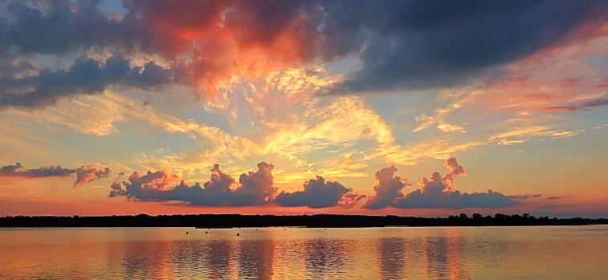

# Hello!  
My name is **Denise Weber** and I am happy you're here!

 I have an Associate's Degree in Software Development and a Responsive Web Design Certificate from freeCodeCamp. I am constantly learning and growing my skills in development and design. I am looking for opportunities where I can contribute, learn and grow in this field. I live and work remotely near Canton, Ohio.
 

## About Me
I'm passionate about learning, technology, collaboration and taking on challenges. Please look around and view some of my work. Other interests are design, travel, photography, my faith, family, friends and **... *sunsets !*{: style="color: red; font-size: 19px;"}**   

 
After working many years remotely in medical records, my entire team was laid off in November 2018 due to our work being sent offshore. As a displaced worker, I had the opportunity to receive training for new job skills through the TAA program. I eagerly pursued an associate degree in Software Development, which was a long-time desire of mine. I am currently looking for opportunities to combine my previous work experience with my training, and to continue learning and growing in this field. Since graduating I have continued to further my knowledge by taking online courses from freeCodeCamp, Udemy and others.

  

## My Work
<section id="projects" class="projects-section">
  
  <h2 class="projects-section-header">View some of my work</h2>
  

  <a href="https://yourdoctorsoffice2021.azurewebsites.net/" target="_blank" class="project-tile">
   
ASP.NET responsive mock doctor's office website

   

    Doctors Office Site
    

  </a>
  <a href="http://dweber-microblog-app.herokuapp.com/" target="_blank" class="project-tile">
   
Python app uses MongoDB/Heroku-mod of Udemy course

 
    

      Mini Chat App
    

    </a>
  <a href="https://deniseweberdev.com/matchGame/" target="_blank" class="project-tile"> 
   
JavaScript responsive game displays modal stats/time

 

      Picture Matching Game
    
  
   </a>
       <a href="https://deniseweberdev.com/Quizzer/" target="_blank" class="project-tile">
        
JavaScript responsive quiz displays correct/total questions.

    
     

      Quizzer
    
   
    </a>   
 
  
  
  <a href="https://codepen.io/denise_weber" class="btn btn-show-all" target="_blank">View More ></a>
</section>

 

## CONTACT ME 
**Click links below to contact me or view additional information**

**[My Email](mailto:dweber0001@gmail.com?subject=[GitHub]%20Source%20MyPortfolio){:target="_blank"}**

**<a href="tel:+3302121204">My Phone</a>**

**[Resume](/images/DeniseWeber Resume.pdf){:target="_blank"}**

**[Responsive Web Design Certificate](https://www.freecodecamp.org/certification/denise_weber/responsive-web-design){:target="_blank"}**

### Thank you for visiting, and I look forward to hearing from you! 
